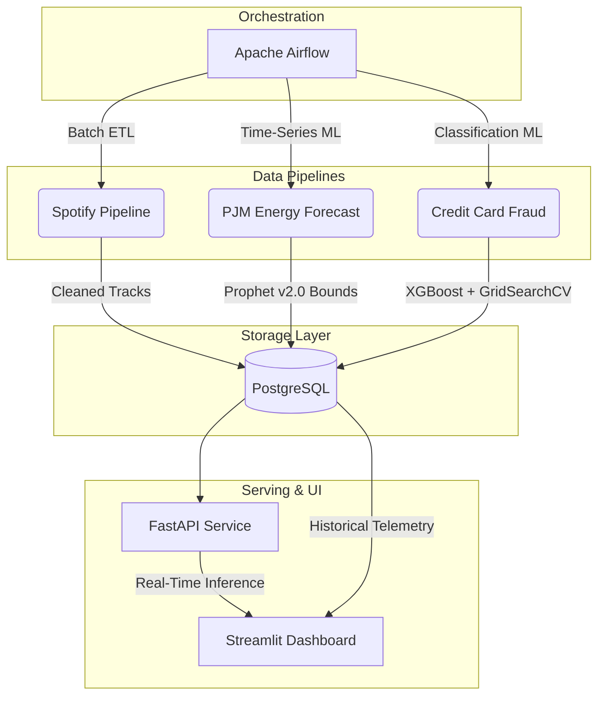

<div align="center">
  <h1>🚀 Multi-Domain Data & ML Platform</h1>
  <p><em>One shared architecture, three different data patterns — batch ETL, time-series forecasting, and real-time serving.</em></p>

  <!-- Badges -->
  <p>
    
    
    
    
    
    
  </p>
</div>

<br />

## 📖 Table of Contents
- [Overview](#-overview)
- [Architecture](#-architecture)
- [The Three Domains](#-the-three-domains)
- [Model Performance \& Metrics](#-model-performance--metrics)
- [Tech Stack](#-tech-stack)
- [Project Structure](#-project-structure)
- [Setup \& Execution](#-setup--execution)
- [License](#-license)

---

## 🌟 Overview

This repository demonstrates a complete, production-ready data engineering and machine learning lifecycle. It proves how a unified infrastructure stack can handle three vastly different domain requirements simultaneously, processing **400,000+ records** with **sub-100ms inference latency**.

---

## 🏗️ Architecture



---

## 🧩 The Three Domains

### 1. 🎵 Spotify Analytics (Batch ETL)
- **Goal:** Extract, clean, and load large CSV datasets into relational structures.
- **Tools:** Pandas, psycopg2, Airflow.
- **Pattern:** Daily scheduled batch ingestion to `spotify.tracks_clean`.

### 2. ⚡ Energy Forecasting (Time-Series ML)
- **Goal:** Forecast hourly energy consumption and detect anomalies.
- **Tools:** Facebook Prophet, ARIMA (baseline), scikit-learn.
- **Pattern:** Weekly scheduled retraining of Prophet v2.0 models with US holiday effects and temporal regressors (`hour_of_day`, `day_of_week`). Predictions with confidence intervals and anomaly flags are logged into `energy.forecasts`.

### 3. 💳 Credit Card Fraud (Real-Time Serving)
- **Goal:** Predict fraudulent transactions in real-time with extreme class imbalance (0.17% fraud rate).
- **Tools:** XGBoost, GridSearchCV, SMOTE (`imbalanced-learn`), FastAPI.
- **Pattern:** Weekly automated retraining of XGBoost with GridSearchCV hyperparameter tuning (24 combinations × 3-fold CV) on SMOTE-balanced data. Velocity feature engineering (`amount_log`, `amount_zscore`) enriches the PCA feature space. The resulting `.joblib` artifact is served via FastAPI (`POST /predict/fraud`) with latency tracking and telemetry logged to `fraud.predictions_log`.

---

## 📈 Model Performance & Metrics

### 🛡️ Financial Fraud Detection (XGBoost + GridSearchCV)

Trained on **284,807 transactions** with extreme class imbalance (99.83% legitimate, 0.17% fraud). SMOTE balances the training set, and GridSearchCV automatically selects optimal hyperparameters (`max_depth=8, n_estimators=200, learning_rate=0.1`).

| Metric | Random Forest v1.0 | XGBoost v2.0 | Improvement |
|:---|:---:|:---:|:---:|
| **Precision** | 0.7027 | **0.7982** | <span style="color:green">+13.6%</span> |
| **Recall** | 0.8814 | **0.8878** | <span style="color:green">+0.7%</span> |
| **F1-Score** | 0.7820 | **0.8406** | <span style="color:green">+7.5%</span> |
| **PR-AUC** | 0.8530 | **0.8851** | <span style="color:green">+3.8%</span> |
| **Inference Latency** | ~86ms | ~86ms | — |

### 📉 Energy Demand Forecasting (Prophet v2.0)

Evaluated across **145,362 hourly readings** from the PJM Interconnection energy grid. Prophet v2.0 adds US holiday effects and temporal regressors, outperforming both the ARIMA baseline and vanilla Prophet.

| Metric | ARIMA Baseline | Prophet v1.0 | Prophet v2.0 | Improvement (v1→v2) |
|:---|:---:|:---:|:---:|:---:|
| **RMSE** | 7164.03 | 4136.06 | **4105.25** | <span style="color:green">-0.7%</span> |
| **MAE** | 6034.35 | 3296.97 | **3273.57** | <span style="color:green">-0.7%</span> |
| **Anomalies Detected** | — | 2367 | **2269** | 98 fewer false flags |

> 💡 **Key Insight:** Prophet v2.0 reduced RMSE by **42.7%** compared to the ARIMA baseline.

---

## 🛠️ Tech Stack

| Category | Technologies Used |
|:---|:---|
| **Orchestration** | Apache Airflow (Docker) |
| **Database** | PostgreSQL 15 (Docker) |
| **Fraud ML** | XGBoost, GridSearchCV, SMOTE |
| **Energy ML** | Facebook Prophet, ARIMA |
| **Data Processing**| Pandas, NumPy, Scikit-learn |
| **API Serving** | FastAPI, Uvicorn |
| **Monitoring UI** | Streamlit |
| **Infrastructure** | Docker, Docker Compose |

---

## 📂 Project Structure

```text
.
├── api/                  # FastAPI real-time serving application
├── dags/                 # Airflow DAGs for batch ETL and ML retraining
├── dashboard/            # Streamlit UI for monitoring and telemetry
├── data/                 # Raw and processed datasets (ignored in git)
├── deploy/               # Deployment manifests (if any)
├── plugins/              # Airflow custom plugins
├── scripts/              # Helper scripts (e.g., data fetchers)
├── tests/                # Unit and integration tests
├── docker-compose.yml    # Multi-container orchestration
├── init.sql              # PostgreSQL initialization scripts
└── README.md             # Project documentation
```

---

## ⚙️ Setup & Execution

### Prerequisites
- [Docker & Docker Compose](https://docs.docker.com/get-docker/) installed and running.
- Python 3.10+ installed locally for helper scripts.
- A [Kaggle Account](https://www.kaggle.com/) to fetch the raw datasets.

### 1. Configure Kaggle Credentials
To keep the repository lightweight, raw datasets are pulled dynamically. 
1. Download your `kaggle.json` from your Kaggle Account Settings.
2. Set them as environment variables:

**Linux / macOS:**
```bash
export KAGGLE_USERNAME="your_username"
export KAGGLE_KEY="your_secret_key"
```

**Windows (PowerShell):**
```powershell
$env:KAGGLE_USERNAME="your_username"
$env:KAGGLE_KEY="your_secret_key"
```

### 2. Fetch the Raw Data
Run the python fetcher script to securely download the datasets into the `data/raw/` directory.
```bash
python scripts/fetch_data.py
```

### 3. Launch the Platform
Ensure Docker Desktop is running, then spin up the entire cluster (this will start PostgreSQL, Airflow, FastAPI, and Streamlit):
```bash
docker-compose up --build -d
```

### 4. Access the Services
Once the containers are running, you can access the platform components at:
- 🌀 **Apache Airflow:** [http://localhost:8080](http://localhost:8080) *(Trigger the DAGs here)*
- ⚡ **FastAPI Docs:** [http://localhost:8000/docs](http://localhost:8000/docs) *(Test the real-time endpoints)*
- 📊 **Streamlit Dashboard:** [http://localhost:8501](http://localhost:8501) *(Monitor telemetry and analytics)*

### 5. Test Fraud Prediction
You can test the real-time serving API using the provided Swagger UI at `http://localhost:8000/docs`, or via CLI:

**Using PowerShell:**
```powershell
$body = @{
    transaction_id = "TEST-001"
    amount = 2500.00
    features = @(0,0,0,0,0,0,0,0,0,0,0,0,0,0,0,0,0,0,0,0,0,0,0,0,0,0,0,0)
} | ConvertTo-Json -Depth 10

Invoke-RestMethod -Uri "http://localhost:8000/predict/fraud" -Method Post -Headers @{"Content-Type"="application/json"} -Body $body
```

**Using cURL:**
```bash
curl -X 'POST' \
  'http://localhost:8000/predict/fraud' \
  -H 'accept: application/json' \
  -H 'Content-Type: application/json' \
  -d '{
  "transaction_id": "TEST-001",
  "amount": 2500.00,
  "features": [0,0,0,0,0,0,0,0,0,0,0,0,0,0,0,0,0,0,0,0,0,0,0,0,0,0,0,0]
}'
```

---

## 📝 License
This project is licensed under the MIT License - see the LICENSE file for details.

---
*Built with ❤️ for Data Engineering & Machine Learning.*
