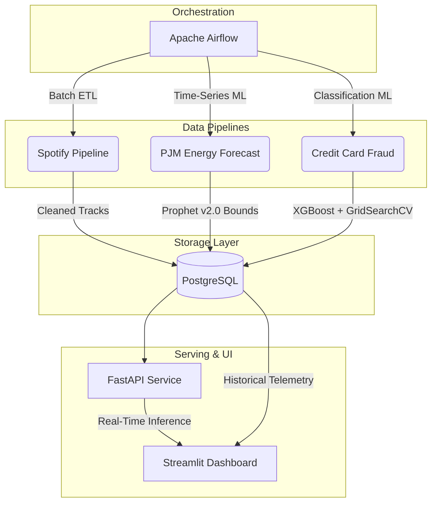

# Multi-Domain Data & ML Platform

*One shared architecture, three different data patterns — batch ETL, time-series forecasting, and real-time serving.*

## 🚀 Overview

This repository demonstrates a complete, production-ready data engineering and machine learning lifecycle. It proves how a unified infrastructure stack—built on **Apache Airflow, PostgreSQL, FastAPI, and Streamlit**—can handle three vastly different domain requirements simultaneously, processing **400,000+ records** with **sub-100ms inference latency**.

## 🏗️ Architecture



## 🧩 The Three Domains

### 1. Spotify Analytics (Batch ETL)
- **Goal:** Extract, clean, and load large CSV datasets into relational structures.
- **Tools:** Pandas, psycopg2, Airflow.
- **Pattern:** Daily scheduled batch ingestion to `spotify.tracks_clean`.

### 2. Energy Forecasting (Time-Series ML)
- **Goal:** Forecast hourly energy consumption and detect anomalies.
- **Tools:** Facebook Prophet, ARIMA (baseline), scikit-learn.
- **Pattern:** Weekly scheduled retraining of Prophet v2.0 models with US holiday effects and temporal regressors (`hour_of_day`, `day_of_week`). Predictions with confidence intervals and anomaly flags are logged into `energy.forecasts`.

### 3. Credit Card Fraud (Real-Time Serving)
- **Goal:** Predict fraudulent transactions in real-time with extreme class imbalance (0.17% fraud rate).
- **Tools:** XGBoost, GridSearchCV, SMOTE (`imbalanced-learn`), FastAPI.
- **Pattern:** Weekly automated retraining of XGBoost with GridSearchCV hyperparameter tuning (24 combinations × 3-fold CV) on SMOTE-balanced data. Velocity feature engineering (`amount_log`, `amount_zscore`) enriches the PCA feature space. The resulting `.joblib` artifact is served via FastAPI (`POST /predict/fraud`) with latency tracking and telemetry logged to `fraud.predictions_log`.

## 📈 Model Performance & Metrics

### Financial Fraud Detection (XGBoost + GridSearchCV)

Trained on **284,807 transactions** with extreme class imbalance (99.83% legitimate, 0.17% fraud). SMOTE balances the training set, and GridSearchCV automatically selects optimal hyperparameters (`max_depth=8, n_estimators=200, learning_rate=0.1`).

| Metric | Random Forest v1.0 | XGBoost v2.0 | Improvement |
|---|---|---|---|
| **Precision** | 0.7027 | **0.7982** | +13.6% |
| **Recall** | 0.8814 | **0.8878** | +0.7% |
| **F1-Score** | 0.7820 | **0.8406** | +7.5% |
| **PR-AUC** | 0.8530 | **0.8851** | +3.8% |
| **Inference Latency** | ~86ms | ~86ms | — |

### Energy Demand Forecasting (Prophet v2.0)

Evaluated across **145,362 hourly readings** from the PJM Interconnection energy grid. Prophet v2.0 adds US holiday effects and temporal regressors, outperforming both the ARIMA baseline and vanilla Prophet.

| Metric | ARIMA Baseline | Prophet v1.0 | Prophet v2.0 | Improvement (v1→v2) |
|---|---|---|---|---|
| **RMSE** | 7164.03 | 4136.06 | **4105.25** | -0.7% |
| **MAE** | 6034.35 | 3296.97 | **3273.57** | -0.7% |
| **Anomalies Detected** | — | 2367 | **2269** | 98 fewer false flags |

> Prophet v2.0 reduced RMSE by **42.7%** compared to the ARIMA baseline.

## 🛠️ Tech Stack

| Component | Technology |
|---|---|
| **Orchestration** | Apache Airflow (Docker) |
| **Database** | PostgreSQL 15 (Docker) |
| **Fraud ML** | XGBoost, GridSearchCV, SMOTE |
| **Energy ML** | Facebook Prophet, ARIMA |
| **Feature Engineering** | Pandas, NumPy, velocity features |
| **API Serving** | FastAPI (sub-100ms latency) |
| **Monitoring UI** | Streamlit |
| **Containerization** | Docker Compose (5 services) |

## ⚙️ Setup & Execution

### 1. Configure Kaggle Credentials
To keep the repository lightweight, raw datasets are pulled dynamically. You must have a Kaggle account.
1. Download your `kaggle.json` from your Kaggle Account Settings.
2. Set them as environment variables:
   ```bash
   export KAGGLE_USERNAME="your_username"
   export KAGGLE_KEY="your_secret_key"
   ```

### 2. Fetch the Raw Data
Run the python fetcher script to securely download the datasets into the `data/raw/` directory.
```bash
python scripts/fetch_data.py
```

### 3. Launch the Platform
Ensure Docker Desktop is running, then spin up the entire cluster:
```bash
docker-compose up --build -d
```

### 4. Access the Services
* **Apache Airflow:** `http://localhost:8080` (Trigger the DAGs here)
* **FastAPI Docs:** `http://localhost:8000/docs` (Test the real-time endpoints)
* **Streamlit Dashboard:** `http://localhost:8501` (Monitor telemetry and analytics)

### 5. Test Fraud Prediction (PowerShell)
```powershell
$body = @{
    transaction_id = "TEST-001"
    amount = 2500.00
    features = @(0,0,0,0,0,0,0,0,0,0,0,0,0,0,0,0,0,0,0,0,0,0,0,0,0,0,0,0)
} | ConvertTo-Json -Depth 10

Invoke-RestMethod -Uri "http://localhost:8000/predict/fraud" -Method Post -Headers @{"Content-Type"="application/json"} -Body $body
```

