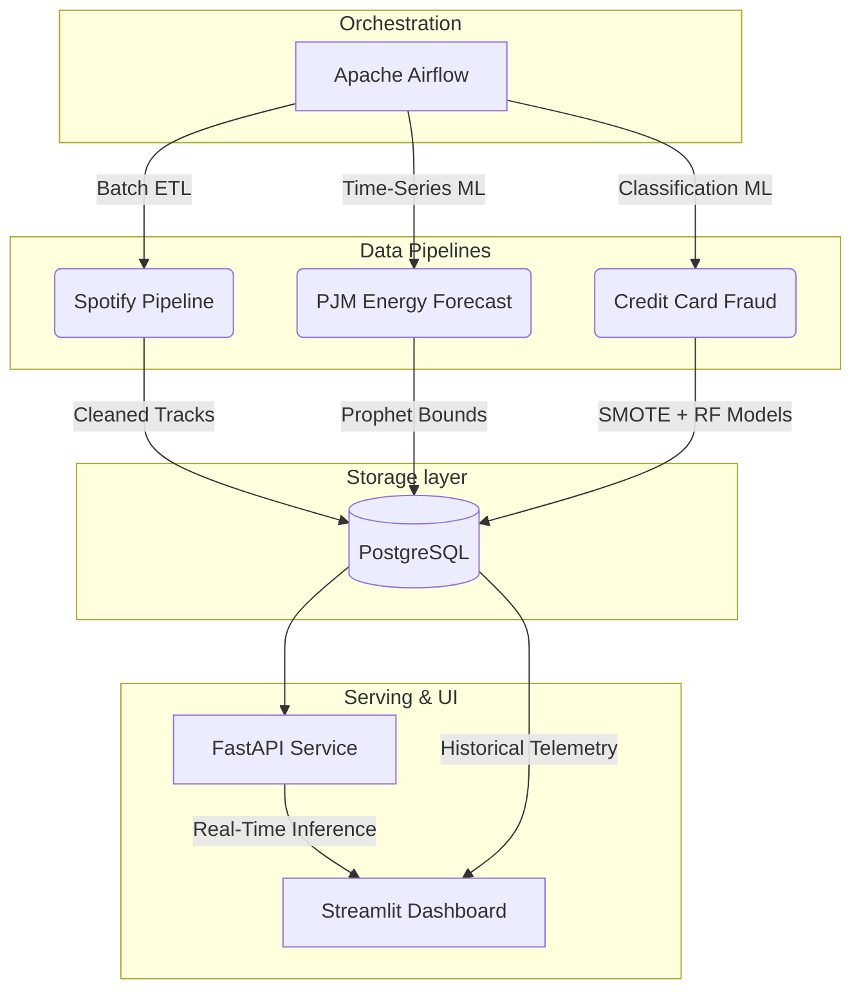

# Multi-Domain Data & ML Platform

*One shared architecture, three different data patterns — batch ETL, time-series forecasting, and real-time serving.*

## 🚀 Overview

This repository demonstrates a complete, production-ready data engineering and machine learning lifecycle. It proves how a unified infrastructure stack—built on **Apache Airflow, PostgreSQL, FastAPI, and Streamlit**—can handle three vastly different domain requirements simultaneously.

## 🏗️ Architecture



## 🧩 The Three Domains

### 1. Spotify Analytics (Batch ETL)
- **Goal:** Extract, clean, and load large CSV datasets into relational structures.
- **Tools:** Pandas, psycopg2, Airflow.
- **Pattern:** Daily scheduled batch ingestion to `spotify.tracks_clean`.

### 2. Energy Forecasting (Time-Series ML)
- **Goal:** Forecast hourly energy consumption and detect anomalies.
- **Tools:** Prophet, scikit-learn.
- **Pattern:** Weekly scheduled retraining of Prophet models. Predictions (including `lower_band` and `upper_band`) and anomalous flags are logged into `energy.forecasts`.

### 3. Credit Card Fraud (Real-Time Serving)
- **Goal:** Predict fraudulent transactions in real-time with extreme class imbalance.
- **Tools:** `imbalanced-learn` (SMOTE), Random Forest, FastAPI.
- **Pattern:** Weekly automated retraining of Random Forest on SMOTE-balanced data. The resulting `.joblib` artifact is served via FastAPI (`POST /predict/fraud`) with latency tracking and PR-AUC telemetry logged directly to `fraud.predictions_log`.

## 🛠️ Tech Stack

| Component | Technology |
|---|---|
| **Orchestration** | Apache Airflow (Docker) |
| **Database** | PostgreSQL (Docker) |
| **ML Models** | Prophet, Random Forest |
| **Data Preprocessing** | Pandas, Numpy, SMOTE |
| **API Serving** | FastAPI |
| **Monitoring UI** | Streamlit |
| **Containerization** | Docker Compose |

## ⚙️ Setup & Execution

### 1. Configure Kaggle Credentials
To keep the repository lightweight, raw datasets are pulled dynamically. You must have a Kaggle account.
1. Download your `kaggle.json` from your Kaggle Account Settings.
2. Set them as environment variables:
   ```bash
   export KAGGLE_USERNAME="your_username"
   export KAGGLE_KEY="your_secret_key"
   ```

### 2. Fetch the Raw Data
Run the python fetcher script to securely download the datasets into the `data/raw/` directory.
```bash
python scripts/fetch_data.py
```

### 3. Launch the Platform
Ensure Docker Desktop is running, then spin up the entire cluster:
```bash
docker-compose up --build -d
```

### 4. Access the Services
* **Apache Airflow:** `http://localhost:8080` (Trigger the DAGs here)
* **FastAPI Docs:** `http://localhost:8000/docs` (Test the real-time endpoints)
* **Streamlit Dashboard:** `http://localhost:8501` (Monitor telemetry and analytics)
